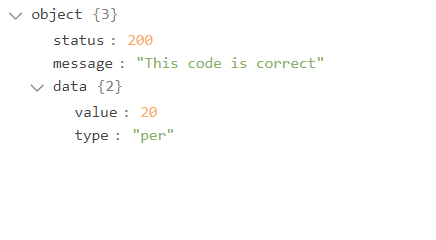

<p align="center"></p>

<p align="center">
<a href="https://github.com/mohamedgammal55/mygift-api/actions"></a>
<a href="https://packagist.org/packages/gemy/mygift-api"></a>
<a href="https://packagist.org/packages/gemy/mygift-api"></a>
<a href="https://packagist.org/packages/gemy/mygift-api"></a>
</p>

<p align="center">
<a href="#!" target="_blank"></a>
<a href="#!" target="_blank"></a>
</p>

## My Gift

My Gift is an application to buy discount coupons

## Installation

You can install the package via composer:

```bash
composer require gemy/mygift-api
```

## setup Database

to setup my gift setting:

```bash
php artisan my-gift:setup
```


## setup Slug

to save your slug on my gift:

```bash
php artisan my-gift:slug
```


### The status codes

These are the codes that will be returned to you in the event of success or failure:

<table style="width:100%">
<thead>
  <tr>
    <th>        status             </th>
    <th>        the meaning             </th>
  </tr>
</thead>
<tbody>
<tr>
<td>200</td>
<td>This code exists, use the data in “data”</td>
</tr>
<tr>
<td>404</td>
<td>This code is invalid</td>
</tr>
<tr>
<td>406</td>
<td>you must send the code</td>
</tr>
<tr>
<td>407</td>
<td>you must send the slug</td>
</tr>
<tr>
<td>408</td>
<td>This code has already been used</td>
</tr>
<tr>
<td>409</td>
<td>This code has expired</td>
</tr>
</tbody>
</table>


#### This is the code when the status is 200

if "type" = "per" It means that it is a percentage, and when it is with "value" it means that it is just a value




## The code

use it as a trait

```bash
use Gemy\MygiftApi\App\MyGiftApi;

class HomeController extends Controller
{
    use MyGiftApi;

    public function checkIfCodeExists()
    {
        $response = $this->checkIfCodeExists('code', 'slug');
        
        //put your code here
    }
    
    public function useCoupon()
    {
        $response = $this->useCoupon('code', 'slug','your order id','The discount value after the calculation');
        
        //put your code here
    }
}
```
